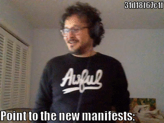
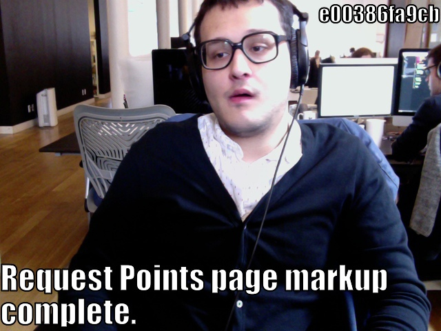
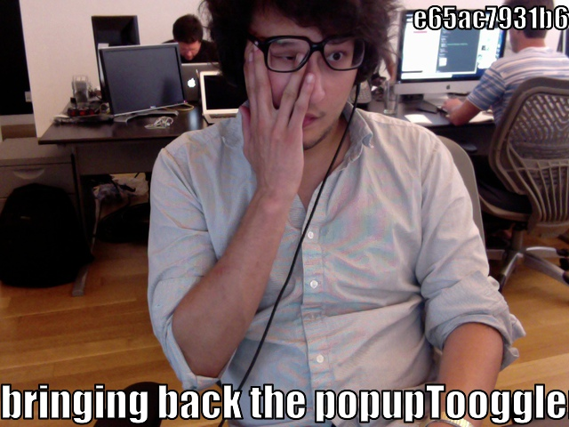
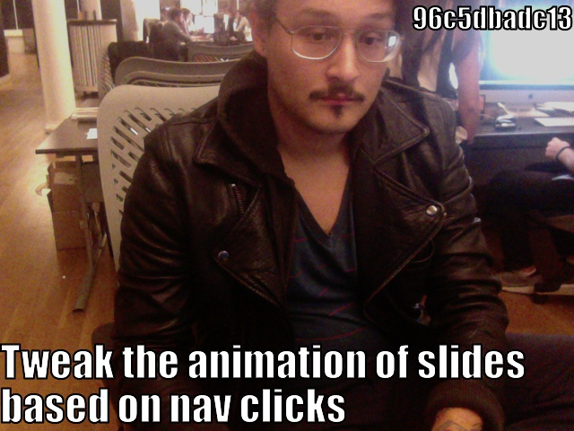
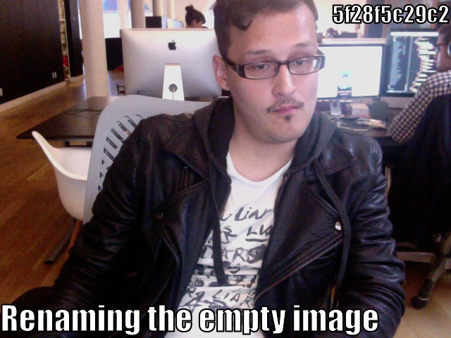
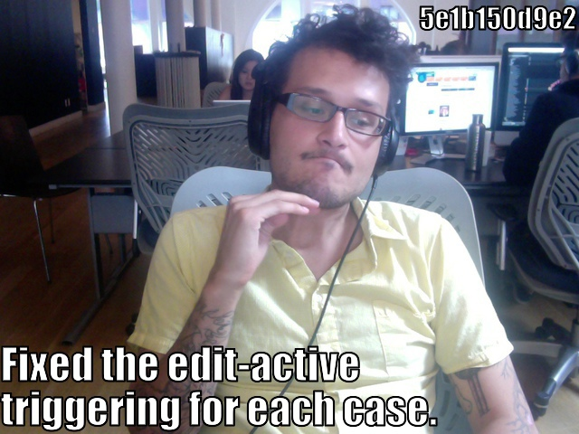

+++
title = "Humanizing computer work"
description = """A short essay about humanizing computer work after going
fully-remote in 2015 and sharing my work-life online using social media."""
date = 2016-05-13
slug = "humanizing-computer-work"
+++

### Roger is working on a computer all the time

I started this [Tumblr][roger-is-working] about a week or two after I started
working at [18F][eighteenf]. This had been my second foray into remote-work life
and I was starting to really miss some of the aspects of checking into an office
building everyday and having living-breathing humans around me that weren't my
living-breathing reflection in the mirror.

So I considered it important to start doing this **publicly**.

I had found out about `lolcommits` from the [Meetup's Hack &
Tell][mu-hack-and-tell] in NYC back in 2011. I had been mesmerized by how simple
the concept of tagging your likeness to a commit would make for better signing
of commits than a GPG key. It made what I do on the computer more approachable.

I would tell friends that I hacked on something over the weekend, and didn't
have anything to show for it. It was either a script or a tweak to my system
that I couldn't really show off. But showing people a series of pictures taken
while I was working on said thing was always easier to show off. More human too.

So I continued from job to job and project to project collecting
`.lolcommit/*.[jpg|gif]` along the way.

    
    

    
    
    

### That remote life

So once I moved from NYC to RVA, I found myself in a predicament. Jobs in
Richmond weren't all they were promised to be, and I started looking for
something else I could work with. So I did what I think most people in my
situation do. I started working remotely. Freelancing at first, and finally
landing my first full-time remote job at 18F.

This is when the real need for something like this came up. I needed a way to
both keep myself sane and express myself to my new coworkers. So I updated my
clone, merged with upstream, and found myself with all these glorious plugins
that hadn't always been available. [So I installed the Tumblr one and wrote
about how to set it up][setting-up-lolcommits].

[mu-hack-and-tell]: http://www.meetup.com/hack-and-tell/ "Meetup's Hack&&Tell"
[roger-is-working]: http://rogerisworking.tumblr.com/ 'Roger Is Working'
[eighteenf]: https://18f.gsa.gov/ '18F Homepage'

[setting-up-lolcommits]:  "Setting up lolcommits guide"
