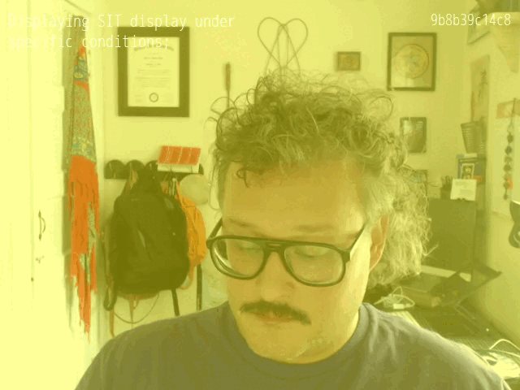

+++
title = "Revisting lolcommits in macOS Sonoma"
date = "2023-09-28"
description = """
I upgraded to macOS Sonoma recently and it brought my career-long lolcommits
setup to a halt! Thankfully troubleshooting and Zsh came to the rescue. But
while I solved the issue I was having, I did start to question whether I should
keep using this tool while Apple fixed their CLI tools.
"""
+++

> `tl;dr`
>
> macOS Sonoma added Continuity Camera to macOS but it had an unintended
> side-effect to my lolcommits setup where internal Apple command-line tools
> would leak deprecation notices that I didn't want. I was able to debug it and
> find a solution using Zsh, consolidated output `{...}`, & `std*` redirection.
> Here's the commit history for this.
>
> [➡️  Commit for solving this particular headache](https://git.sr.ht/~rogeruiz/.files/commit/fbd4fadecc2b3de101829e7109ecab5f5f5ecc05).

Whenever we upgrade software we run risks of custom tooling breaking. Especially
tooling that touches obscure APIs. _While not upgrading the software is the best
way to avoid this, it's also a great security risk!_ So make sure you update your
software sooner rather than later. Even if this means you risk encountering bugs
that you might avoid by waiting to upgrade. You'll be able to stretch your
troubleshooting muscles and might even be able to contribute to the fix or at
the very least mitigate it in your own custom way.

In this post, I'll talk about how I encountered a deprecation notice within a
tool that I use regularly called `lolcommits` and `system_profiler` and how
upgrading to macOS Sonoma broke my `post-commit` hook in Git.

If you want to learn more about `lolcommits`, check out their website.

[➡️  lolcommits: selfies for software developers](https://lolcommits.github.io)

I've been leveraging this tool to take selfies for quite a long time. When I
went fully remote in 2015, I created a little Tumblr site to capture all these
automatically and save them for the world to see.



[➡️  roger is working](https://lol.rogeruiz.com/)

For many many years this setup was fine. That is until I upgraded to macOS
Sonoma and found that the tooling that I had written to find what camera was
plugged into my Mac was spitting out all sort of internal deprecation notices
that were outside of the scope of what I was doing. While the notices were
interesting to me to see how the CLI tool worked, this particular deprecation
notice targeted at the internal tools team at Apple. At least that's my best
guess. The CLI tool in question here is `system_profiler`.

<details>
<summary>Click here to see what the <code>man system_profiler</code> page looks like at the time of
this writing.</summary>

```
SYSTEM_PROFILER(8)                                  System Manager's Manual                                  SYSTEM_PROFILER(8)

NAME
     system_profiler – reports system hardware and software configuration.

SYNOPSIS
     system_profiler [-usage]
     system_profiler [-listDataTypes]
     system_profiler [-xml] dataType1 ... dataTypeN
     system_profiler [-xml] [-detailLevel level]
     system_profiler [-json] dataType1 ... dataTypeN
     system_profiler [-json] [-detailLevel level]

DESCRIPTION
     system_profiler reports on the hardware and software configuration of the system.  It can generate plain text reports or
     XML reports which can be opened with System Information.app, or JSON reports

     Progress and error messages are printed to stderr while actual report data is printed to stdout.  Redirect stderr to
     /dev/null to suppress progress and error messages.

     The following options are available:

     -xml                Generates a report in XML format.  If the XML report is redirected to a file with a ".spx" suffix that
                         file can be opened with System Information.app.

     -json               Generates a report in JSON format.

     -listDataTypes      Lists the available datatypes.

     -detailLevel level  Specifies the level of detail for the report:

                         mini          report with no personal information

                         basic         basic hardware and network information

                         full          all available information

     -timeout            Specifies the maximum time to wait in seconds for results.  If some information is not available
                         within the specified time limit then an incomplete or partial report will be generated.  The default
                         timeout is 180 seconds.  Specifying a timeout of 0 means no timeout.

     -usage              Prints usage info and examples.

EXAMPLES
     system_profiler
       Generates a text report with the standard detail level.

     system_profiler -detailLevel mini
       Generates a short report containing no personal information.

     system_profiler -listDataTypes
       Shows a list of the available data types.

     system_profiler SPSoftwareDataType SPNetworkDataType
       Generates a text report containing only software and network data.

     system_profiler -xml > MyReport.spx
       Creates a XML file which can be opened by System Profiler.app

AUTHORS
     Apple Inc.

Darwin                                                   June 30, 2003                                                   Darwin
```
</details>

If you opened the details above, you can notice that the author is Apple. A bug
in someone else's code and not my own. Also it's neat that `system_profiler` was
introduced in 2003 which means it was in the end-of-life for Mac OS X 10.2
Jaguar and most likely in anticipation for the release of Mac OS X 10.3 Jaguar.

## Okay, so what is happening here?

So you might be wondering what the heck is this all about? Basically, the issue
at hand here is that there is a deprecation notice whenever the API
`AVCaptureDeviceTypeExternal` is called due to the new Continuity Camera feature
of macOS Sonoma. The culprit was a command that I had worked on previously to
speed up my `post-commit` hook because it was taking longer than I wanted to
execute.

```sh
system_profiler \
    SPCameraDataType \
    -json \
    -detailLevel basic \
    | jq -r '.SPCameraDataType[]."_name" | select(. | test("C920"))'
```

Whenever I ran this command, I would get the following output. I'm breaking it
down with `stderr` first then `stdout`.

```sh
# stderr*
2023-09-28 17:37:20.563 system_profiler[34077:36102507] WARNING: AVCaptureDeviceTypeExternal is deprecated for Continuity Cameras. Please use AVCaptureDeviceTypeContinuityCamera and add NSCameraUseContinuityCameraDeviceType to your Info.plist.

# * as you'll read later, it's not quite stderr
```

```sh
# stdout
HD Pro Webcam C920
```

It turns out though that the command `lolcommits --capture [...]` also displays
the deprecation notice even though it's not directly calling `system_profiler`
in its codebase. This behavior lead me to think that the deprecation notice was
not coming from either `system_profiler` nor `lolcommits --capture`. So I tried
a little experiment. Let's send `stderr` to `/dev/null` and all we're left with
is the `stdout`, right?


```sh
>_ system_profiler \
       SPCameraDataType \
       -json \
       -detailLevel basic \
       | jq -r '.SPCameraDataType[]."_name" | select(. | test("C920"))' \
   2>/dev/null

2023-09-28 17:37:20.563 system_profiler[34077:36102507] WARNING: AVCaptureDeviceTypeExternal is deprecated for Continuity Cameras. Please use AVCaptureDeviceTypeContinuityCamera and add NSCameraUseContinuityCameraDeviceType to your Info.plist.
HD Pro Webcam C920
```

### Why I'm still getting the deprecation notice

As you can see above, I'm still getting the deprecation notice no matter that I
redirected `stderr` to `/dev/null`. This was what helped me realize that the
error was internal to whatever API `system_profiler` and `lolcommits --capture`
were running under the hood. Because of this I really needed to consider a
number of options, but ultimately went with the idea of just throwing all the
output of the command over to `/dev/null`.

| Plan | Likelihood | Solution |
| ---- | ---------- | -------- |
| A | Not likely | Removing `lolcommit` from my `post-commit` workflow |
| B | Not likely | Hard-code the camera to `HD Pro Webcam C920` |
| C | Not likely | Wait for Apple to fix things? |
| D | Chosen | Figure out how to "trap" or redirect the output I don't want and capture the output I need |
| E | Not likely | Do nothing and suffer the deprecation warning until Plan C plays out |

#### My reasoning for going with Plan D

As you may have figured out by now, I am someone who is curious by default. If
there's something that I need to figure out and can figure out, I will try my
best to figure it out. So when it came to this, I decided to troubleshoot how to
best "trap" or redirect output of commands. This is where I thought of using the
`{...}` curly braces to capture all of the output. This is useful when you are
trying to capture all the output of multiple commands into a consolidated
output. This is because `{` and `}` _reserved words_ or commands built into the
shell. When grouping commands like this you need to make sure that you're
terminating lines with a `;` semicolon if they're not terminated by `\r`
carriage returns.

```sh
{
system_profiler \
    SPCameraDataType \
    -json \
    -detailLevel basic \
    | jq -r '.SPCameraDataType[]."_name" | select(. | test("C920"))' \
} 2>/dev/null
```

With this command, all the output I get now is the return of the `jq` command
that tests for the string `C920` which is the model of my external webcam.

## Determining what should get sent where and why

So ultimately after being able to only see the output of the. I needed
to ensure that I was still capturing output that I needed to set my variable
`LOLCOMMITS_DEVICE` to whatever camera is available. I managed to do this above
by only sending the consolidated output for `stderr` over to `/dev/null` but the
`stdout` was still being returned.

Further down in my `post-commit` hook, I also had to fix encountering the same
deprecation warning over when I ran `lolcommits --capture`. I handled this by
just redirecting **all of the output** over to `/dev/null` because of the
thought by Plan A.

```sh
# shellcheck disable=SC2086
lolcommits \
    --capture \
    --stealth \
    --delay 2 \
    --fork \
    ${animado-} > /dev/null 2>&1
#               ^^^^^^^^^^^^^^^^
```

If I'm considering removing something, the first step for me
when it comes to long-term maintainence is to see what it's like to live
without. Now if `lolcommits --capture` ever fails, I won't know about it. For
now I haven't noticed a problem. There are times where `lolcommits --capture`
doesn't seem to execute, but that's okay. I find that running a camera capture
at the end of every commit can be slow. This way I don't get bogged down by a
slow capture for any reason.

## Thinking about script portability

So at this point, you may have realized that I've been using Zsh as the
execution environment. My thoughts behind this is that while I usually execute
my shell scripts in Bash but since this script is so Apple tooling specific due
to `system_profiler`. Since macOS Catalina, Zsh has been the default shell for
macOS going forward. Since I'm already being so Apple-specific in my query for a
camera, I figured let's go all the way. It was also an issue because of the way
output grouping works in a Bash `$(...)` sub-shell versus a Zsh `$(...)`
sub-shell.
